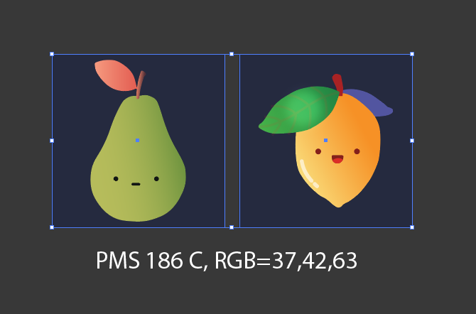

# Selected Colors to Clipboard

> [Created by request on the Illustrator forums here](https://community.adobe.com/t5/illustrator-discussions/copy-color-values-to-clipboard/td-p/13789558)

Illustrator script to copy selected color values in the form [TYPE]=[VALUES] to a user's clipboard, preferring SPOT color names over values:

In the above, the left selected rectangle is a spot color with the name `PMS 186 C` whereas the right is a vanilla RGB color.
